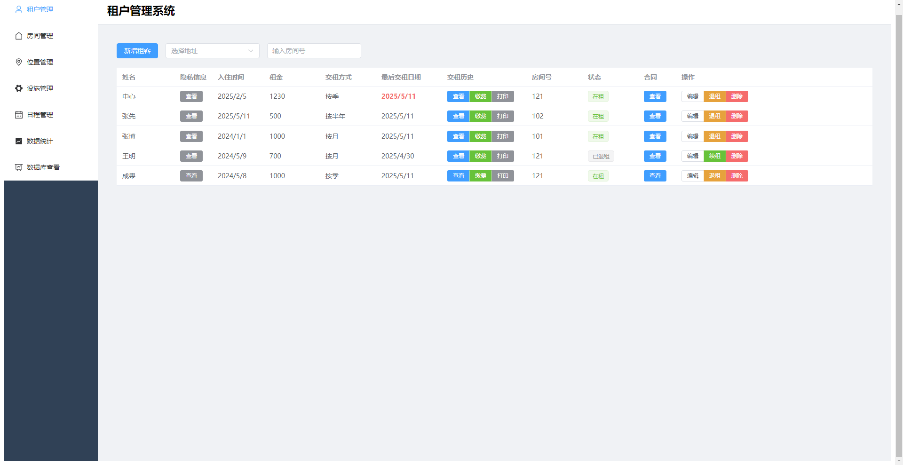
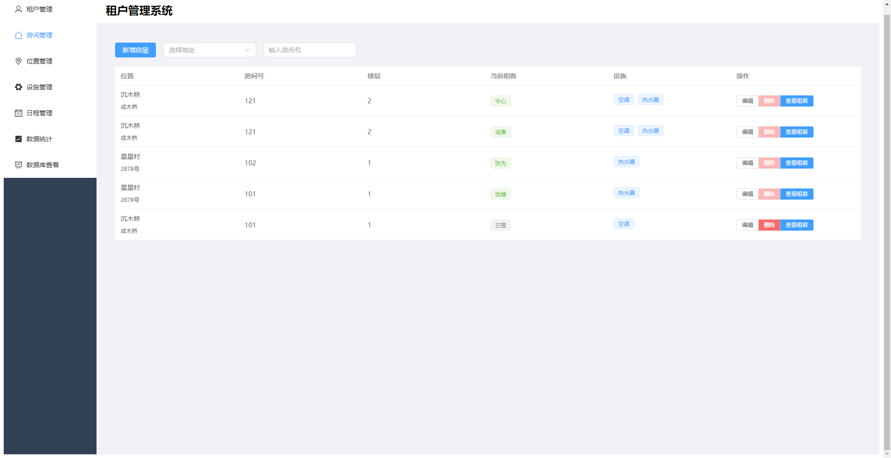
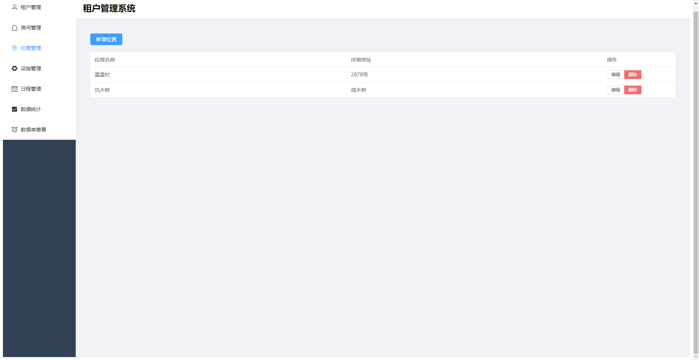
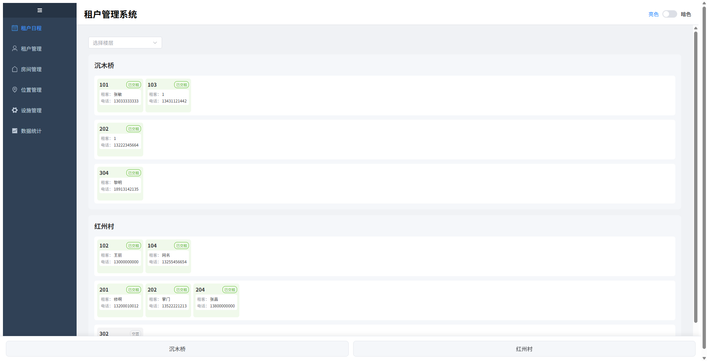
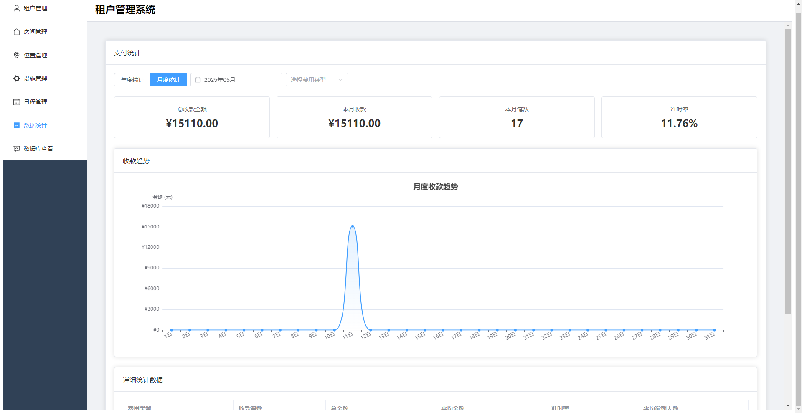

fb 前后端分离版本，前端nodejs，后端python，小程序正在制作

together 前后端不分离版本，丢弃了。前后端都是nodejs

# Reb Block - 租客管理系统 (Tenant Management System)

A modern tenant management system built with Electron and Vue 3, designed for managing rental properties and tenant information.

一个基于 Electron + Vue 3 的现代租客管理系统，用于管理房屋租赁相关信息。

## Features 功能特点

- 📋 Tenant Management (租客管理)
  - Basic information and lease management (基本信息和租约管理)
  - Payment tracking and reminders (租金追踪和提醒)
- 🏠 Property Management (房屋管理)
  - Location and room management (位置和房间管理)
  - Facility configuration (设施配置)
- ⚡ Facility Management (设施管理)
  - Equipment and maintenance (设备和维护)
- 📅 Schedule Management (日程管理)
  - Rent collection and alerts (收租和提醒)
- 📊 Data Statistics (数据统计)
  - Performance analysis (运营分析)

## Database Schema 数据库结构

The system uses SQLite with the following main tables:
系统使用 SQLite 数据库，主要包含以下表：

- `tenants`: Tenant information 租客信息
- `rooms`: Property information 房屋信息
- `facilities`: Facility information 设施信息
- `room_facilities`: Room-facility associations 房屋-设施关联
- `contract_photos`: Contract photos 合同照片

## Screenshots 界面截图

### Tenant Management 租客管理

租户在预定缴纳租金时未缴费的7天前会变成红色状态提醒，如入住时已缴3月租金，但是3个月后的前7天还未缴费，最后交租日期会变为红色。

### Property Management 房间管理

房屋管理系统支持详细的房间信息记录，包括位置、房间号、设施配置等信息的管理。

### Location Management 位置管理

多级位置管理系统，支持房间的层级化管理，方便不同区域房产的统一管理。

### Facility Management 设施管理

完整的设施管理功能，支持设备清单维护和房间设施关联。

### Schedule Management 日程管理

智能日程管理系统，自动提醒租金缴纳日期，并提供清晰的状态显示。

### Data Statistics 数据统计

全面的数据统计功能，帮助管理者了解经营状况。

## TODO List 待办事项

The following features are currently under development:
以下功能正在开发中：

- 📊 Data Statistics and Analytics 数据统计分析
  - Occupancy rate analysis 入住率分析
  - Payment history tracking 支付历史追踪
  - Property performance metrics 房屋表现指标

- 🔄 Performance optimization 性能优化

## Contributing 贡献指南

Contributions are welcome! Please feel free to submit a Pull Request.
欢迎贡献！请随时提交 Pull Request。

## License 许可证

[MIT License](LICENSE) 
