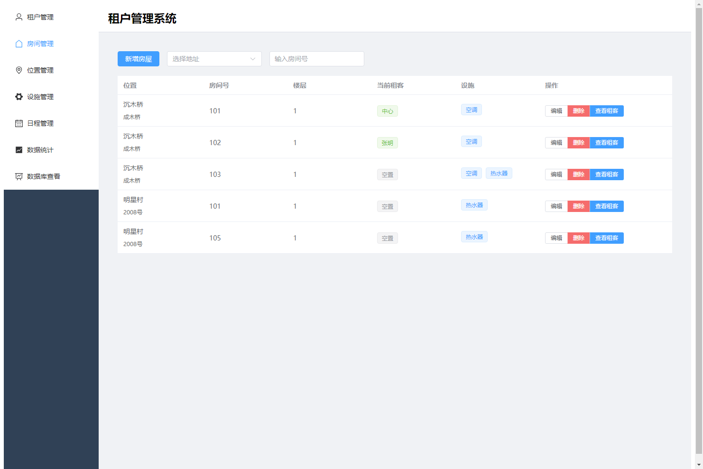
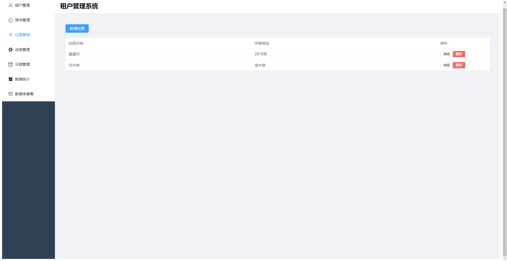
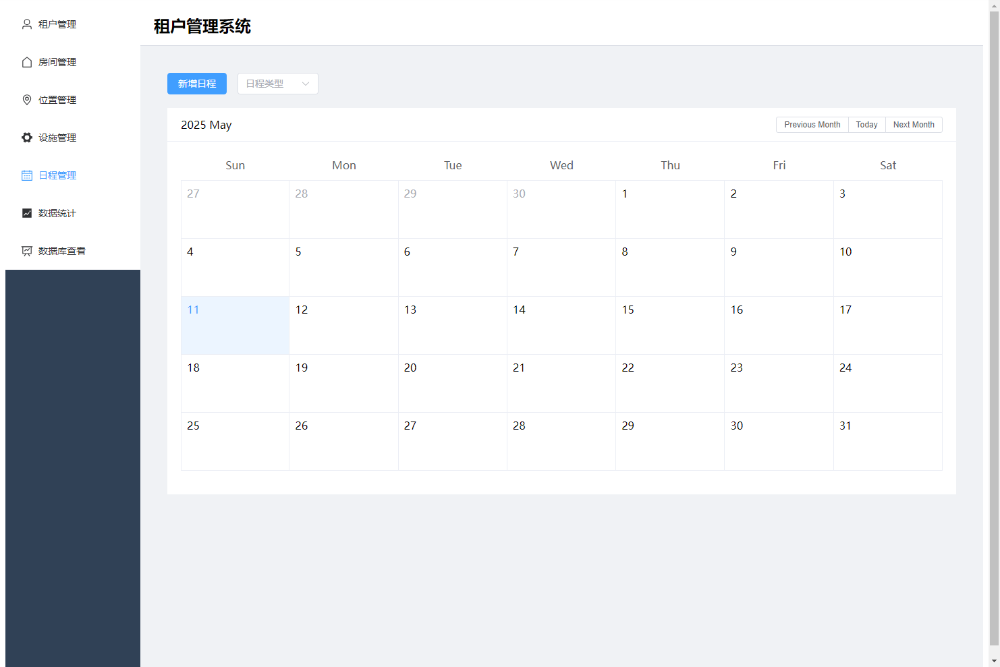
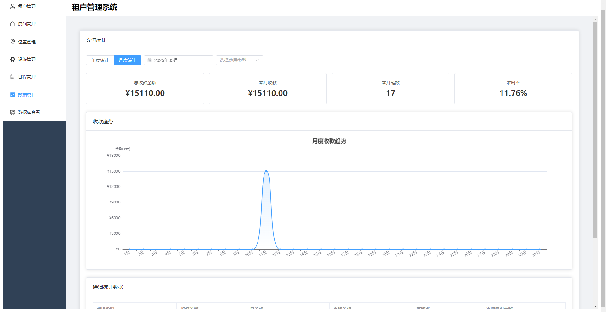

# Reb Block - 租客管理系统 (Tenant Management System)

A modern tenant management system built with Electron and Vue 3, designed for managing rental properties and tenant information.

一个基于 Electron + Vue 3 的现代租客管理系统，用于管理房屋租赁相关信息。

## Features 功能特点

- 📋 Tenant Information Management (租客管理)
  - Basic tenant details (基本信息)
  - Lease information (租约信息)
  - Payment tracking with reminder system (租金追踪和提醒系统)
  - Automatic payment status updates (自动付款状态更新)
- 🏠 Property Management (房屋管理)
  - Multi-level location management (多级位置管理)
    - Province and city (省市管理)
    - District and community (区域和小区)
    - Building and unit (楼栋单元)
  - Room management (房间管理)
    - Room numbering (房间编号)
    - Room types (房型分类)
    - Status tracking (状态追踪)
  - Facility mapping (设施配置)
    - Room facilities (房间设施)
    - Public facilities (公共设施)
- ⚡ Facility Management (设施管理)
  - Equipment inventory (设备清单)
  - Maintenance records (维护记录)
  - Facility-room mapping (设施房间映射)
- 📅 Schedule Management (日程管理)
  - Rent collection reminders (收租提醒)
  - Payment status tracking (支付状态追踪)
  - Automatic overdue alerts (自动逾期提醒)
- 📊 Data Statistics (数据统计)
  - Revenue analysis (收入分析)
  - Occupancy metrics (入住率统计)
  - Payment tracking (支付追踪)

## Tech Stack 技术栈

- 🔧 [Electron](https://www.electronjs.org/) - Desktop application framework
- 🖼️ [Vue 3](https://vuejs.org/) - Frontend framework
- 🎨 [Element Plus](https://element-plus.org/) - UI components
- 💾 [SQLite](https://www.sqlite.org/) - Database
- 📦 [Pinia](https://pinia.vuejs.org/) - State management
- 🛣️ [Vue Router](https://router.vuejs.org/) - Navigation

## Prerequisites 开发环境要求

- Node.js >= 18.20.3
- npm >= 10.7.0

## Installation 安装步骤

1. Clone the repository 克隆项目
```bash
git clone [repository-url]
cd reb-block
```

2. Install dependencies 安装依赖
```bash
npm install
```

3. Run in development mode 开发模式运行
```bash
npm run electron:dev
```

4. Build the application 构建应用
```bash
npm run electron:build
```

## Project Structure 项目结构

```
src/
├── modules/          # Feature modules 功能模块
│   ├── tenant/      # Tenant management 租客管理
│   ├── property/    # Property management 房屋管理
│   ├── facility/    # Facility management 设施管理
│   └── schedule/    # Schedule management 日程管理
├── stores/          # Pinia state management 状态管理
├── router/          # Route configuration 路由配置
└── views/           # Page components 页面组件
```

## Database Schema 数据库结构

The system uses SQLite with the following main tables:
系统使用 SQLite 数据库，主要包含以下表：

- `tenants`: Tenant information 租客信息
- `rooms`: Property information 房屋信息
- `facilities`: Facility information 设施信息
- `room_facilities`: Room-facility associations 房屋-设施关联
- `contract_photos`: Contract photos 合同照片

## Development Notes 开发说明

1. Frontend code changes hot-reload automatically in development mode
   前端代码修改会自动热重载

2. Main process code changes require application restart
   主进程代码修改需要重启应用

3. Database file is stored in the application data directory
   数据库文件存储在应用数据目录

## Important Notes 注意事项

- ⚠️ Ensure Electron DevTools are properly configured in the development environment
  请确保在开发环境中正确配置了 Electron 的开发者工具

- 🔍 Verify all dependency versions before production build
  生产环境构建前请检查所有依赖版本

- 💾 Use transactions for database operations to ensure data consistency
  数据库操作请使用事务确保数据一致性

## Screenshots 界面截图

### Tenant Management 租户管理


租户在预定缴纳租金时未缴费的7天前会变成红色状态提醒，如入住时已缴3月租金，但是3个月后的前7天还未缴费，最后交租日期会变为红色。

### Property Management 房间管理


房屋管理系统支持详细的房间信息记录，包括位置、房间号、设施配置等信息的管理。

### Location Management 位置管理


多级位置管理系统，支持房间的层级化管理，方便不同区域房产的统一管理。

### Facility Management 设施管理


完整的设施管理功能，支持设备清单维护和房间设施关联。

### Schedule Management 日程管理


智能日程管理系统，自动提醒租金缴纳日期，并提供清晰的状态显示。

### Data Statistics 数据统计


全面的数据统计功能，帮助管理者了解经营状况。

## TODO List 待办事项

The following features are currently under development:
以下功能正在开发中：

- 📅 Schedule Management System 日程管理系统
  - Rent collection reminders 收租提醒
  - Contract renewal notifications 合同续签通知
  - Maintenance schedule 维护计划安排

- 📊 Data Statistics and Analytics 数据统计分析
  - Occupancy rate analysis 入住率分析
  - Payment history tracking 支付历史追踪
  - Property performance metrics 房屋表现指标

- 🔄 Frontend-Backend Separation 前后端分离
  - API standardization API标准化
  - Independent deployment 独立部署
  - Performance optimization 性能优化

## Contributing 贡献指南

Contributions are welcome! Please feel free to submit a Pull Request.
欢迎贡献！请随时提交 Pull Request。

## License 许可证

[MIT License](LICENSE) 